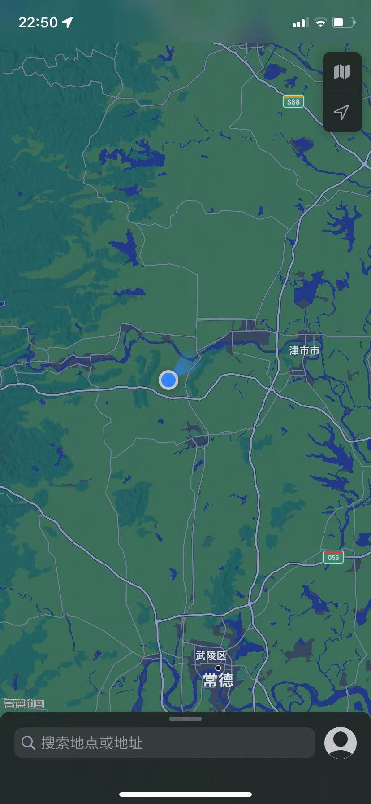
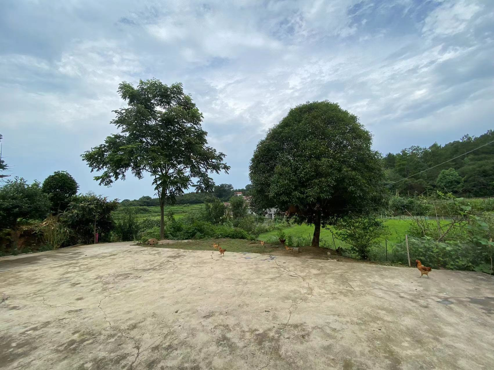

My Home

location:

0, 俺这地儿

 

在一个遥远的南方，童山下，澧水畔。
童山，其实就是一个小山包，相对高度不足百米，山上也仅有草庵一间，女尼二三人。据闻站在童山顶能俯揽澧阳平原，风景还是可以的。
澧水虽小，宽不足百米，但也是洞庭湖的四个水系（湘资沅澧）之末，往年间春讯时节，河水往往漫到两岸，于是我的同学们在饱受防汛之苦的同时，也不时能体会到在自家的房屋的大厅里面就能抓到几尾大鱼的童趣与惊喜。
（图片待补）

1，俺家

 
 我们这里是丘陵地带，基本上都是靠着某个高点的土包打下宅基地，
 比不得城里的高楼广厦，也不是传说中的别的农村那样的二层小楼，自来水电宽带什么的都还齐全，家里也流行偶尔美团买菜里面去买菜。
 感谢乡里某些乡绅的慷慨解囊，现在能够开车直接到家门口了，去县城只要半个小时，一个小时能到市里，到长沙也不过三个小时。（不过由于驾照还在实习期，无法上高速，去长沙的成就尚待解锁。）
 就是最近的县城里面外卖不发达，点外卖几乎不可能，最近的麦当劳在60公里外，肯德基在40公里外。
 
 2,田园风光

 2.1 月桂

 
 家门前是两颗树，右边是一棵月桂，左边是....(可能也是一个棵桂树)，稍远点的荆棘，据说是黄栀子，
 四时都有美景，夏季满眼绿色，秋季黄栀子盛开，冬季万物藏匿，高高的天幕下一片寂寥，“万类霜天竞自由”！
 重点要说的是春天，三四月间，桂树还没有长出绿叶，只有满树的美丽的白色花瓣，从黄昏到拂晓，在如水的月光下，玉树琼花，满世界都是淡淡的银白色的光芒，人间仙境，莫过如此。
 （ps：那地上不是灰尘没有扫净，是原本的晒谷场由于没有使用废弃了，春雨的时候都长出了青苔，青苔晒枯萎之后就是这样。由于现在晒谷场基本没用，估计短期内也不会翻新了。）

 2.2 鸡冠花

 
 现在这样的花花，也挺美。
 然而，十月间，才是鸡冠花怒放的时候，鸡冠花非常容易繁殖，乡间小路两旁，满满的怒放的鸡冠花，红红火火的色调，欢迎远方的客人的到来。
 （怒放的鸡冠花，图片待补）

 2.3 油菜花

 （油菜花美景图，待补）
 月桂未谢，油菜花已开。
 本来油菜就是我们这里的主要种植作物之一，那时节，满眼都是金黄，满眼都是春天的气息。婺源也未必比得上。

 2.4 野猪，松菇，茶苞，春笋

 
 （松菇图待补）
 由于缺水，原来的水稻田都种了玉米，有一天发现，玉米被糟蹋了，于是，大家意识到，在寻常的野鸡，兔子，黄鼠狼等等之后，野猪也大量出现了。
 现在乡里大家出门都是开车，摩托，或者三轮，自行车都不骑了，除了几条乡间水泥公路，以前的山间小径已经没有人走了，于是重新布满了杂草荆棘！
 小时候的这个时节，应该是漫山遍野的上树找茶苞，树下采松菇的时候，可惜，今年少雨，图片待补。

 2.5 辣椒自由，茄子自由，豇豆自由，西红柿自由...

 
 这是家里的菜园子，应该还有一块儿，现在地里种的是辣椒茄子西红柿西瓜等，根据时节的变化，可能会换成应季的菠菜黄瓜丝瓜什么的，吃不完，完全吃不完！现在好多黄瓜西红柿茄子都只能眼睁睁的看着烂在地里了。

 2.6 山中不晓数甲子

村里面有好几种桃树，水蜜桃香甜无比，我已经吃了两茬饱桃了，这第三批桃的果子已经不小了，就等它啥时候成熟了。
是不是有种孙悟空在方寸山的感觉？
村里还有各种板栗,梨子，柚子，枇杷，蜜桔等等，我正在找，看看树在哪里。

2.7 一蓑风雨任平生

在城里讨生活的时候天天幻想着，回家之后，在春雨里面，披个蓑衣钓鱼。
现在完全不是那么回事，除了视力不好看鱼漂有难度，主要是现在居然年年大旱，池塘里面难得有几天水满的时候，刚到秋收，池塘就几乎都干涸见底了。
饶是这样，我们这里的各种野塘，哪怕只剩一洼水，一网下去，总能捞上来几条一两斤的草鱼，大自然的馈赠真是慷慨异常呀！

2.8 烟雨

如果说燕赵大地，主色调是黄沙漫天，离水畔击筑高歌，阳关外羌笛悠悠，那么，江南的画面，至少有一半的美景应该是细细的春雨下，人面桃花相映红。
（@todo：烟雨图待补）

@photo by iphone 11

